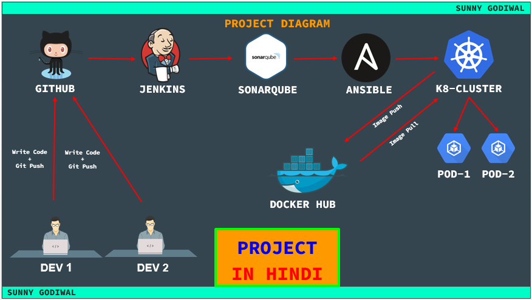

# +++++ PROJECT-1 +++++

### Last Tested
```
Date:  07-May-2023
```
## +++++++++++++++++++++++++++ PART-1 ++++++++++++++++++++++++++++

### Overview of project-1



<br/>
<br/>

## +++++++++++++++++++++++++++ PART-2 ++++++++++++++++++++++++++++

### Configure all below pre-requisites for project.

<br/>

1. **[Install Jenkins & Ansible & Maven ](https://github.com/sunnydevops2022/DevOps/blob/master/ubuntu/devops_real_time_project/project_1/jenkins_ansible_installation_p1.md)**

1. **[Install Sonarqube](https://github.com/sunnydevops2022/DevOps/blob/master/ubuntu/devops_real_time_project/project_1/sonarqube_installation_p1.md)**

1. **[Install Kubernetes Cluster](https://github.com/sunnydevops2022/DevOps/blob/master/ubuntu/devops_real_time_project/project_1/kubernetes_installation_p1.md)**

1. **[Git Account](https://github.com/)**

1. **[Dockerhub Account](https://hub.docker.com/)**


<br/>
<br/>

## +++++++++++++++++++++++++++ PART-3 ++++++++++++++++++++++++++++

### Configure jenkins pipeline job. 
```
Login Jenkins > New Item > project-1 > Pipeline > OK

		               Pipeline:
		                    Definition: Pipeline script from SCM
		               
		               SCM: Git

		                 Repositories:
		                      Repository URL: https://github.com/sunnydevops2022/devops_real_time_project_1.git

		                 Script Path: Jenkinsfile   
```
<br/>

### Jenkins integration with Sonarqube server.

<br/>

### Login Sonarqube server
```
Sonarqube > My Account > Security > Generate Tokens
                                          Name    : porject-1
					  Type    : Global Analysis Token
					  Expires : 30 Days
Generate

After that copy token & save it.
```

### Go to Jenkins and create credential for Sonar token
```
Dashboard > Manage Jenkins > Credentials > System Global credentials (unrestricted) > Add credentials > 
                                                                                            kind: Secret text
                                                                                            Scope: Global
                                                                                            Secret: ******
                                                                                            ID: SONAR_TOKEN
                                                                                            Des: SONAR_TOKEN
Create
```
<br/>

### Configure inventry file & Password less authentication with Kubernetes server.
```
+++++++++++++++ KUBERNETES SERVER ++++++++++++++++++++++

passwd root
cp -r /etc/ssh/sshd_config /etc/ssh/sshd_config_orig
sed -i "s/#PermitRootLogin prohibit-password/PermitRootLogin yes/g" /etc/ssh/sshd_config
sed -i "s/PasswordAuthentication no/PasswordAuthentication yes/g" /etc/ssh/sshd_config
systemctl restart sshd.service

+++++++++++++++ ANSIBLE SERVER ++++++++++++++++++++++

cat /etc/ansible/hosts
> /etc/ansible/hosts
cat /etc/ansible/hosts

vim /etc/ansible/hosts

[kubernetes]
<kubernetes_ip>

cat /etc/ansible/hosts
su - jenkins
ansible -m ping kubernetes -u root
ssh root@<kubernetes_ip>
ssh-keygen
ssh-copy-id root@<kubernetes_ip>
ssh root@<kubernetes_ip>

ansible -m ping kubernetes -u root
```
<br/>

### Create credential for Dockerhub server login.
```
Dashboard > Manage Jenkins > Credentials > System Global credentials (unrestricted) > Add credentials > 
                                                                                            kind: Secret text
                                                                                            Scope: Global
                                                                                            Secret: ******
                                                                                            ID: DOCKERHUB_USER
                                                                                            Des: DOCKERHUB_USER
Create

##################################

Dashboard > Manage Jenkins > Credentials > System Global credentials (unrestricted) > Add credentials > 
                                                                                            kind: Secret text
                                                                                            Scope: Global
                                                                                            Secret: ******
                                                                                            ID: DOCKERHUB_PASS
                                                                                            Des: DOCKERHUB_PASS
Create
```
<br/>

### Github integrate with Jenkins.
```
+++++++++++++++ GITHUB ACCOUNT ++++++++++++++++++++++
Github > Repository > Settings > Webhooks > Add Webhooks >
						Payload UR   : http://<jenkins_ip>:8080/github-webhook/
						Content type : application/json

						Just the push event.
						
+++++++++++++++ JENKINS SERVER ++++++++++++++++++++++						

Jenkins > project-1 > Configure > Build Triggers > 
                                          GitHub hook trigger for GITScm polling
```

<br/>
<br/>
<br/>
<br/>

## `*************************   EOF   *************************`
